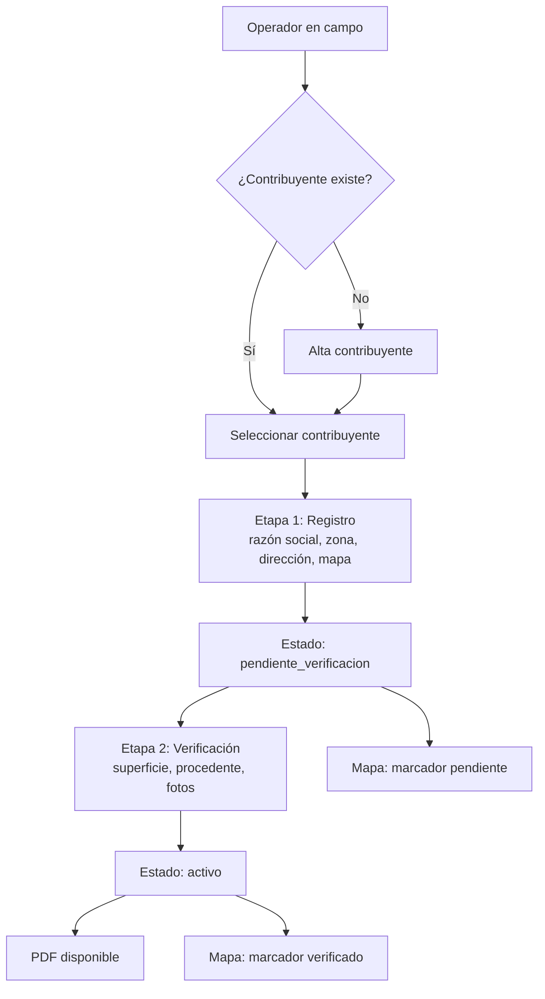
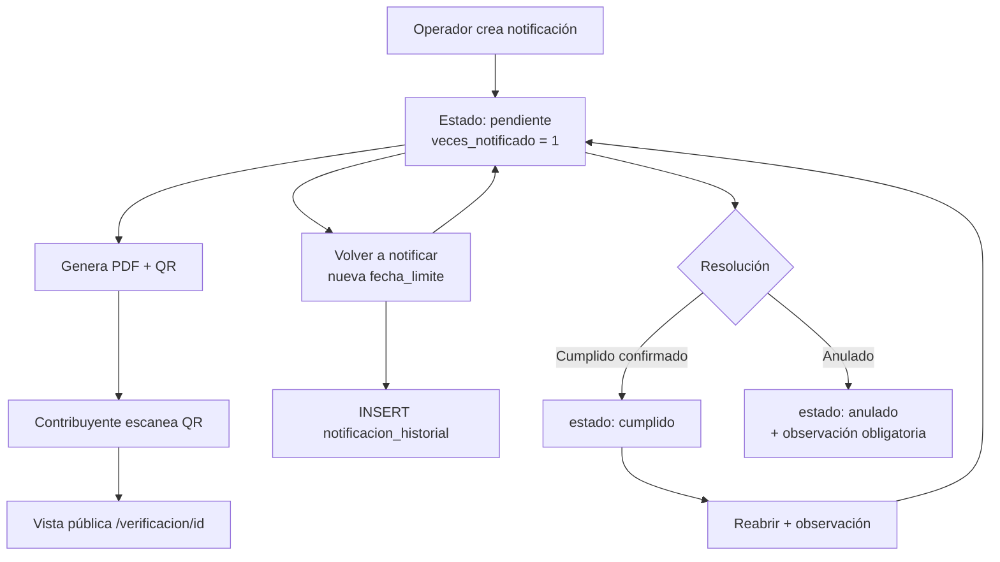
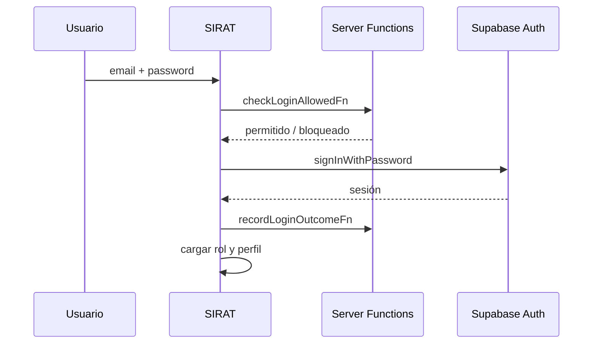

# PRD — SIRAT
## Sistema Integrado de Registro y Administración Tributaria

| Campo | Valor |
|-------|-------|
| **Cliente** | Gobierno Autónomo Municipal de Riberalta — Jefatura de Recaudaciones |
| **Versión del documento** | 1.2.8 |
| **Versión del producto** | 1.0.94 |
| **Fecha** | Mayo 2026 |
| **Estado** | Basado en el código en producción/desarrollo actual |

---

## 1. Resumen ejecutivo

**SIRAT** es una aplicación web orientada a trabajo de campo y oficina para la gestión tributaria municipal. Permite mantener el padrón de contribuyentes, registrar y verificar actividades económicas en dos etapas, emitir notificaciones tributarias con documento PDF y código QR verificable, visualizar ubicaciones en mapa y exportar reportes institucionales.

El sistema está diseñado para operadores de recaudación en terreno y administradores que supervisan usuarios, estados y reportes. La identidad visual y los documentos impresos reflejan la institucionalidad del GAM Riberalta.

---

## 2. Problema y oportunidad

### 2.1 Problema

La gestión tributaria municipal en Riberalta requiere:

- Registrar contribuyentes y sus actividades económicas con ubicación geográfica verificable.
- Separar el **registro en campo** de la **verificación técnica** (superficie, procedencia, padrón, bebidas alcohólicas).
- Emitir notificaciones formales que el contribuyente pueda verificar sin iniciar sesión (QR).
- Controlar accesos, intentos fallidos de login y roles diferenciados.
- Generar reportes exportables para seguimiento administrativo.

Sin un sistema integrado, estos procesos dependen de papel, hojas de cálculo dispersas o herramientas no conectadas, lo que dificulta la trazabilidad, la georreferenciación y la consulta pública de notificaciones.

### 2.2 Oportunidad

Unificar en una sola plataforma web responsive (móvil + escritorio) el ciclo: **contribuyente → actividad económica → notificación → mapa → reporte**, con autenticación segura, PDF institucional y verificación pública por QR.

---

## 3. Objetivos del producto

| # | Objetivo | Indicador de éxito |
|---|----------|-------------------|
| O1 | Digitalizar el registro y verificación de actividades económicas | Formularios creados con coordenadas y estado `activo` tras verificación |
| O2 | Agilizar notificaciones tributarias en campo | Notificaciones con PDF, QR y ubicación opcional |
| O3 | Centralizar el padrón de contribuyentes | C.I. única, búsqueda y vínculo con formularios/notificaciones |
| O4 | Dar visibilidad geográfica | Mapa con actividades activas y pendientes de verificación |
| O5 | Facilitar reportes administrativos | Exportación Excel/PDF por rango de fechas (hasta 1 000 registros) |
| O6 | Garantizar seguridad operativa | Roles, bloqueo por intentos, gestión de usuarios por admin |

---

## 4. Usuarios y roles

### 4.1 Personas

| Persona | Descripción | Rol en sistema |
|---------|-------------|----------------|
| **Operador de recaudación** | Personal de campo que registra contribuyentes, formularios y notificaciones | `operador` |
| **Administrador** | Responsable de usuarios, políticas de acceso y acciones sensibles (baja/anulación de formularios) | `admin` |
| **Contribuyente / tercero** | Consulta una notificación vía QR sin cuenta | Público (sin autenticación) |

### 4.2 Matriz de permisos (implementada)

| Módulo | Operador | Admin |
|--------|:--------:|:-----:|
| Inicio (dashboard) | ✓ | ✓ |
| Contribuyentes (CRUD en UI) | ✓ | ✓ |
| Formularios (registro + verificación) | ✓ | ✓ |
| Baja / anulación de formulario activo | ✓ (con observación) | ✓ |
| Notificaciones | ✓ | ✓ |
| Mapa | ✓ | ✓ |
| Reportes | ✓ | ✓ |
| Usuarios | ✗ | ✓ |
| Mi cuenta (cambio de contraseña) | ✓ | ✓ |

> **Nota:** El primer usuario registrado en el sistema recibe automáticamente rol `admin`; los siguientes, `operador`.

---

## 5. Alcance

### 5.1 Dentro del alcance (v1 actual)

- Autenticación por correo y contraseña (Supabase Auth).
- Gestión de contribuyentes con C.I. única.
- Formularios de actividades económicas en **dos etapas** (registro → verificación).
- Hasta 3 fotos por formulario verificado (almacenamiento privado).
- Notificaciones tributarias con conceptos múltiples, PDF, QR y vista pública.
- Mapa Leaflet de actividades con coordenadas.
- Reportes exportables (formularios, notificaciones, contribuyentes).
- Administración de usuarios (alta, edición, reset de contraseña por correo).
- Interfaz responsive con navegación inferior en móvil.
- Dashboard operativo con KPIs, trabajo pendiente y enlaces filtrados a listados.
- Verificación pública de formularios vía QR (`/verificacion-formulario/{id}`).
- Despliegue en Cloudflare Workers o Vercel.

### 5.2 Fuera del alcance (v1)

- Autogestión de recuperación de contraseña por el usuario final (debe contactar al administrador).
- Portal del contribuyente autenticado.
- Facturación, cobranza o integración con sistemas nacionales (SIGEP, etc.).
- Módulo de auditoría transaccional en UI (tabla `auditoria` eliminada del esquema).
- Numeración correlativa automática de formularios/notificaciones (eliminada).
- Tipos de notificación formal (aviso / advertencia / multa) como campo separado (eliminado).
- Eliminación de contribuyentes desde la UI (RLS permite DELETE solo sin vínculos; no expuesto en interfaz).

### 5.3 Roadmap sugerido (no implementado)

- Sincronización offline en campo.
- Dashboard analítico con gráficos temporales (el panel operativo actual no incluye series históricas).
- Notificaciones push o SMS.
- Firma digital del contribuyente en dispositivo.
- Integración con catastro o GIS municipal.

---

## 6. Requisitos funcionales

### 6.1 Autenticación y sesión

| ID | Requisito | Prioridad |
|----|-----------|-----------|
| AUTH-01 | Login con correo y contraseña (mín. 6 caracteres) | Must |
| AUTH-02 | Bloquear acceso si `profiles.activo = false` | Must |
| AUTH-03 | Bloquear acceso si `profiles.bloqueado = true` | Must |
| AUTH-04 | Bloquear acceso si `intentos_fallidos >= 5` | Must |
| AUTH-05 | Registrar éxito/fallo de login y actualizar contador | Must |
| AUTH-06 | Redirigir rutas protegidas a `/login` sin sesión | Must |
| AUTH-07 | Cambio de contraseña en `/perfil` con contraseña actual | Must |
| AUTH-08 | Mensaje en login: recuperación solo vía administrador | Should |

### 6.2 Dashboard (`/`)

| ID | Requisito | Prioridad |
|----|-----------|-----------|
| DASH-01 | KPIs con enlace al listado filtrado: pendientes de verificación, notificaciones pendientes, actividades verificadas, contribuyentes, actividades de baja, mapa (pendientes) | Must |
| DASH-02 | Resaltar KPIs con pendientes (borde ámbar) cuando el contador > 0 | Should |
| DASH-03 | Sección «Tu trabajo pendiente»: hasta 5 formularios `pendiente_verificacion` y 5 notificaciones `pendiente` con enlace al detalle | Must |
| DASH-04 | Mensaje positivo cuando no hay pendientes de verificación ni notificaciones | Should |
| DASH-05 | Accesos rápidos: nuevo formulario, nueva notificación, nuevo contribuyente, reportes | Must |
| DASH-06 | Botón «Actualizar» para recargar contadores y listas | Should |
| DASH-07 | Admin: aviso si hay usuarios bloqueados o inactivos (enlace a `/usuarios`) | Should |
| DASH-08 | Saludo con nombre y rol del usuario | Must |

**Parámetros de enlace desde KPIs**

| KPI | Ruta destino |
|-----|----------------|
| Pendientes de verificación | `/formularios?filtro=pendientes` |
| Notificaciones pendientes | `/notificaciones?estado=pendiente` |
| Actividades verificadas | `/formularios?filtro=activos` |
| Actividades de baja | `/formularios?filtro=baja` |
| En mapa (pendientes) | `/mapa?filtro=pendientes` |

### 6.3 Contribuyentes (`/contribuyentes`)

| ID | Requisito | Prioridad |
|----|-----------|-----------|
| CONT-01 | Alta con C.I. (única), nombre completo, teléfono opcional | Must |
| CONT-02 | Normalizar textos a MAYÚSCULAS (`es-BO`) al guardar | Must |
| CONT-03 | Lista paginada (20/página), orden por fecha de creación descendente | Must |
| CONT-04 | Búsqueda por nombre o C.I. (debounce 400 ms) | Must |
| CONT-05 | Alta en diálogo modal; edición en diálogo desde menú ⋮ o botón lápiz (no al abrir detalle) | Must |
| CONT-06 | Detalle en `/contribuyentes/$id` **solo lectura** (`DetailTemplate`): C.I., nombre, celular, fecha de registro, formularios vinculados, conteo de notificaciones | Must |
| CONT-07 | Indicador “Sin actividades” vs “Con formularios o notif.” en lista | Should |
| CONT-08 | Eliminar solo si no tiene formularios ni notificaciones (RLS; sin UI de borrado) | Could |
| CONT-09 | Lista: tarjetas en móvil, tabla en escritorio; acciones lápiz (editar) y menú (Editar datos / Ver detalle) | Must |
| CONT-10 | Clic en nombre del contribuyente navega al detalle; la fila no abre el editor | Must |

### 6.4 Formularios — Actividades económicas (`/formularios`)

**Nombre formal:** *Formulario de registro y verificación de actividades económicas*.

#### Etapa 1 — Registro

| ID | Requisito | Prioridad |
|----|-----------|-----------|
| FORM-01 | Vincular contribuyente existente o dar de alta uno nuevo desde el flujo | Must |
| FORM-23 | Campo **Tipo de trámite** obligatorio en etapa 1: selección desde catálogo o alta de nuevo tipo (operador y admin) | Must |
| FORM-02 | Campos: razón social, NIT opcional, zona (A–E), dirección, celular, referencia | Must |
| FORM-03 | Ubicación obligatoria: latitud, longitud, zoom de mapa | Must |
| FORM-04 | Resolver coordenadas desde enlace WhatsApp/Google Maps | Should |
| FORM-05 | Estado inicial: `pendiente_verificacion`; `superficie = null` | Must |
| FORM-06 | Restricción UNIQUE (`contribuyente_id`, `razon_social`) | Must |

#### Etapa 2 — Verificación

| ID | Requisito | Prioridad |
|----|-----------|-----------|
| FORM-07 | Superficie > 0 m² | Must |
| FORM-08 | Campo `procedente` (sí/no) obligatorio | Must |
| FORM-09 | Al menos uno de: `padron` o `bebidas_alcoholicas` | Must |
| FORM-10 | Hasta 3 fotos (máx. 500 KB c/u, compresión cliente) | Must |
| FORM-11 | Al completar: `estado = activo`, `verificado_por`, `verificado_at` | Must |
| FORM-12 | Edición por pestañas Registro / Verificación en diálogo | Must |

#### Estados y acciones

| Estado | Descripción | Transiciones permitidas |
|--------|-------------|---------------------------|
| `pendiente_verificacion` | Registro sin verificar | → `activo` (verificación) |
| `activo` | Verificado y vigente | → `baja`, `anulado` (observación obligatoria) |
| `baja` | Dado de baja | Sin edición |
| `anulado` | Anulado | Sin edición |

| ID | Requisito | Prioridad |
|----|-----------|-----------|
| FORM-13 | Filtros de lista: Todos / Pendientes / Verificados / Baja / Anulados; sincronizados con URL `?filtro=` | Must |
| FORM-14 | Búsqueda por razón social o contribuyente | Must |
| FORM-15 | Detalle `/formularios/$id` con PDF, fotos, mapa; contribuyente y C.I. en filas separadas | Must |
| FORM-16 | PDF con QR de verificación pública; solo si `activo` y `superficie` definida | Must |
| FORM-17 | Baja: operador y admin en `activo`; observación obligatoria; hasta 2 fotos nuevas (Storage `formulario-baja-fotos`); PDF «BAJA DE ACTIVIDAD ECONÓMICA» guardado en Storage (`formulario-baja-pdf`, sin descarga automática); fecha en PDF = fecha de baja; sin procedente/padrón/bebidas; anulación solo observación | Must |
| FORM-21 | En detalle `baja`: botones «PDF registro» (verificación, intacto) y «PDF baja» (archivo guardado) | Must |
| FORM-18 | Tarjetas en móvil, tabla en escritorio (patrón `DataListCard`) | Must |
| FORM-19 | En móvil, filtros en una sola fila con desplazamiento horizontal | Should |
| FORM-20 | Campos de verificación no completados (`pendiente_verificacion` y `superficie` nula): mostrar `—` en detalle, PDF y reportes (no valores por defecto de BD) | Must |
| FORM-22 | Etapa 2: tabla dinámica de ambientes (ambiente, largo, ancho, superficie calculada, total); `formulario_ambientes`; total en `formularios.superficie`; tabla en PDF, detalle y QR | Must |
| FORM-21 | Vista pública `/verificacion-formulario/$id` y QR en PDF del formulario | Must |

### 6.5 Notificaciones (`/notificaciones`)

| ID | Requisito | Prioridad |
|----|-----------|-----------|
| NOT-01 | Contribuyente opcional | Must |
| NOT-02 | Campos: nombre actividad, nº identificación (licencia/placa/inmueble), dirección, fecha límite | Must |
| NOT-03 | Ubicación en mapa (lat, lng, zoom) — opcional | Must |
| NOT-04 | Al menos un concepto: padrón municipal, permiso bebidas alcohólicas, impuestos patente, bienes inmuebles, vehículos | Must |
| NOT-05 | Texto libre: “Observaciones y/o gestiones adeudadas” | Must |
| NOT-06 | Estados: `pendiente` → `cumplido` \| `anulado` | Must |
| NOT-07 | Editar solo en estado `pendiente` | Must |
| NOT-08 | Anular requiere observación en `observacion_seguimiento` | Must |
| NOT-09 | PDF institucional + QR con URL `/verificacion/{id}` | Must |
| NOT-10 | Vista pública `/verificacion/$id` sin login (server function + service role) | Must |
| NOT-11 | Compatibilidad QR antiguo `/v/notificacion?d=` | Should |
| NOT-12 | Filtros de lista: Todas / Pendientes / Cumplidas / Anuladas; URL `?estado=` | Must |
| NOT-13 | Tarjetas en móvil, tabla en escritorio (patrón `DataListCard`) | Must |
| NOT-14 | **Volver a notificar** solo en estado `pendiente`: registra nueva `fecha_limite`, incrementa `veces_notificado`, mantiene el mismo `id`/QR | Must |
| NOT-15 | Historial append-only (`notificacion_historial`): cada fecha límite con número, fecha y observación opcional; visible en detalle; edición no cambia fecha (solo renotificar) | Must |
| NOT-16 | Detalle de notificación alineado a plantilla institucional (secciones Contribuyente / Notificación tributaria / Seguimiento); barra de acciones compacta | Should |
| NOT-17 | Enlace «Cómo llegar en Google Maps» en mapas de solo lectura (detalle notificación y formulario) | Should |
| NOT-18 | PDF y vista pública muestran `veces_notificado` (N.º de notificación) además de la fecha límite vigente | Must |
| NOT-19 | Menú «Más acciones» (operador y admin en `pendiente`): marcar cumplida con confirmación; anular con observación obligatoria | Must |
| NOT-20 | Reabrir (`cumplido` → `pendiente`): **solo admin** en «Más acciones», con observación obligatoria; el operador conserva PDF, QR, editar y renotificar según estado | Must |

### 6.6 Mapa (`/mapa`)

| ID | Requisito | Prioridad |
|----|-----------|-----------|
| MAP-01 | Mostrar formularios con coordenadas en estado `activo` o `pendiente_verificacion` (límite 500) | Must |
| MAP-02 | Filtros: todos / pendientes / verificados | Must |
| MAP-03 | Búsqueda por razón social o nombre de contribuyente | Must |
| MAP-04 | Modo foco: `?actividad={id}` centra una actividad | Should |
| MAP-05 | Tiles OpenStreetMap (sin API key) | Must |
| MAP-06 | Filtro inicial vía URL `?filtro=pendientes` o `?filtro=verificados` | Should |
| MAP-07 | Mensaje contextual en vacío según filtro (p. ej. «Sin actividades pendientes») | Should |

### 6.7 Reportes (`/reportes`)

| ID | Requisito | Prioridad |
|----|-----------|-----------|
| REP-01 | Tipos: formularios, notificaciones, contribuyentes | Must |
| REP-02 | Filtro por rango `created_at` (desde / hasta) | Must |
| REP-03 | Límite 1 000 filas por exportación | Must |
| REP-04 | Exportar Excel (`xlsx-js-style`) y PDF (`jspdf` + `jspdf-autotable`) | Must |
| REP-05 | Colores institucionales en reportes (`SIRAT_REPORT_COLORS`) | Should |
| REP-06 | Exportación de formularios: columna **Estado**; sin columna coordenadas; campos de verificación pendiente exportan `—` | Must |
| REP-07 | Título de reporte de formularios sin subtítulo «LISTADO DE…» (solo título institucional) | Should |

### 6.8 Usuarios (`/usuarios`) — solo admin

| ID | Requisito | Prioridad |
|----|-----------|-----------|
| USR-01 | Listar usuarios con rol, estado, intentos fallidos | Must |
| USR-02 | Alta: nombre, correo, contraseña inicial, rol | Must |
| USR-03 | Edición: nombre, correo, C.I., activo, bloqueado, rol, intentos | Must |
| USR-04 | Enviar enlace de restablecimiento de contraseña por correo | Must |
| USR-05 | Impedir que el único admin se degrade a operador | Must |
| USR-06 | Búsqueda y paginación; diseño alineado con otras listas | Must |

---

## 7. Requisitos no funcionales

### 7.1 Rendimiento

- Listas paginadas: 20 registros por página.
- Búsqueda con debounce de 400 ms.
- Mapa: carga hasta 500 marcadores.
- Reportes: máximo 1 000 filas por consulta.

### 7.2 Disponibilidad y despliegue

- Hosting: **Cloudflare Workers** (default) o **Vercel** (`VERCEL=1` → Nitro).
- Puerto de desarrollo: `5740`.
- Variables: `VITE_SUPABASE_URL`, `VITE_SUPABASE_PUBLISHABLE_KEY`, `SUPABASE_SERVICE_ROLE_KEY` (servidor), `VITE_PUBLIC_APP_URL` (QR).

### 7.3 Seguridad

- RLS en todas las tablas operativas; operaciones privilegiadas vía server functions con service role.
- Bucket `formulario-fotos` privado; lectura solo autenticados.
- Sin exposición de service role en el cliente.
- Validación de sesión en funciones admin.

### 7.4 Usabilidad

- Diseño mobile-first con barra inferior (Inicio, Contrib., Formul., Notif., Mapa).
- Sidebar en escritorio (256px).
- Fuentes: Inter (UI), Playfair Display (títulos).
- Toasts Sonner para feedback.
- Fechas en formato Bolivia (`es-BO`).

### 7.5 Mantenibilidad

- Versión única en `package.json` → `SIRAT_APP_VERSION`.
- Bump automático de patch en cada commit (`pre-commit` hook).

---

## 8. Modelo de datos

### 8.1 Diagrama entidad-relación (simplificado)

```
auth.users ──1:1── profiles
auth.users ──1:N── user_roles

contribuyentes ──1:N── formularios
contribuyentes ──0:N── notificaciones (contribuyente_id nullable)

formularios ──1:N── formulario_fotos (máx. 3, trigger DB)
```

### 8.2 Tablas principales

| Tabla | Propósito |
|-------|-----------|
| `profiles` | Perfil extendido del usuario Auth |
| `user_roles` | Rol: `admin` \| `operador` |
| `contribuyentes` | Padrón municipal (C.I. UNIQUE) |
| `tipos_tramite` | Catálogo de tipos de trámite (etapa 1 formularios) |
| `formularios` | Actividad económica georreferenciada |
| `formulario_fotos` | Rutas en Storage |
| `notificaciones` | Notificación tributaria (`veces_notificado`, `fecha_limite` vigente) |
| `notificacion_historial` | Historial de fechas límite por renotificación (append-only) |

### 8.3 Enumeraciones

```text
app_role:            admin | operador
formulario_estado:   activo | baja | anulado | pendiente_verificacion
notificacion_estado: pendiente | cumplido | anulado
zona_tipo:           A | B | C | D | E
```

### 8.4 Reglas de integridad destacadas

- `contribuyentes.ci` UNIQUE.
- `formularios(contribuyente_id, razon_social)` UNIQUE.
- DELETE `contribuyentes` solo sin formularios ni notificaciones vinculadas.
- Máximo 3 filas en `formulario_fotos` por `formulario_id` (trigger).

---

## 9. Flujos de usuario

### 9.1 Registro y verificación de actividad económica



### 9.2 Emisión y verificación pública de notificación



### 9.3 Ciclo de vida de sesión



---

## 10. Arquitectura técnica

### 10.1 Stack

| Capa | Tecnología |
|------|------------|
| Frontend | React 19, TanStack Router, TanStack Start |
| Estilos | Tailwind CSS 4, shadcn/ui (Radix) |
| Formularios | react-hook-form, Zod, `sirat-forms.ts` |
| Backend datos | Supabase (PostgreSQL, Auth, Storage) |
| Lógica servidor | TanStack `createServerFn` en `src/functions/` |
| Mapas | Leaflet + react-leaflet |
| Documentos | jsPDF, jspdf-autotable, html2canvas, qrcode |
| Excel | xlsx, xlsx-js-style |
| Build | Vite 7 |
| Deploy | Cloudflare Workers / Vercel |

### 10.2 Server functions

| Función | Responsabilidad |
|---------|-----------------|
| `checkLoginAllowedFn` / `recordLoginOutcomeFn` | Seguridad de login |
| `adminCreateUserFn` | Alta usuario Auth + rol |
| `adminUpdateUserFn` | Actualizar perfil y rol |
| `adminResetPasswordEmailFn` | Email de reset Supabase |
| `getNotificacionPublicaFn` | Lectura pública para QR de notificación |
| `getFormularioPublicaFn` | Lectura pública para QR de formulario |
| `resolveMapLocationFn` | Parseo de URLs de mapas |

### 10.3 Rutas de la aplicación

**Públicas**

| Ruta | Descripción |
|------|-------------|
| `/login` | Autenticación |
| `/verificacion/$id` | Vista pública de notificación |
| `/verificacion-formulario/$id` | Vista pública de formulario (QR en PDF) |
| `/v/notificacion` | Compatibilidad QR legacy |

**Autenticadas**

| Ruta | Módulo |
|------|--------|
| `/` | Dashboard |
| `/contribuyentes`, `/contribuyentes/$id` | Contribuyentes |
| `/formularios`, `/formularios/$id` | Formularios |
| `/notificaciones`, `/notificaciones/$id` | Notificaciones |
| `/mapa` | Mapa |
| `/reportes` | Reportes |
| `/usuarios` | Usuarios (admin) |
| `/perfil` | Mi cuenta |

---

## 11. Experiencia de usuario

### 11.1 Principios de diseño

- **Institucional:** colores primario, dorado y verde del GAM; tipografía serif en títulos.
- **Campo primero:** botones grandes, mapa integrado, captura de ubicación GPS.
- **Consistencia de listas:** `DataListCard` — tarjetas en móvil, tabla en desktop, paginación uniforme.
- **Diálogos modales** para altas y ediciones rápidas sin abandonar la lista.
- **Detalle de contribuyente** en modo consulta; la edición es acción explícita desde la lista.
- **Dashboard** como punto de entrada operativo: prioriza pendientes de verificación y notificaciones.

### 11.2 Navegación móvil

Barra inferior fija: **Inicio**, **Contrib.**, **Formul.**, **Notif.**, **Mapa**.  
Menú lateral (hamburguesa): ítem de formularios etiquetado **Formulario** (no «Verificación»).  
Reportes, Usuarios y Perfil accesibles desde el menú lateral.

### 11.3 Documentos impresos

- **Formulario PDF:** encabezado GAM Riberalta, QR de verificación alineado con el título, mapa capturado, fotos, firmas (incl. “Encargado de Ruat”); campos sin verificar muestran `—`.
- **Notificación PDF:** título “NOTIFICACIÓN”, conceptos marcados, QR de verificación.

---

## 12. Criterios de aceptación globales

1. Un operador puede completar el flujo contribuyente → registro → verificación → PDF sin salir de la app en móvil.
2. Una notificación emitida genera QR que abre la vista pública sin login.
3. Un admin puede crear usuario, bloquear cuenta y reiniciar intentos de login.
4. El mapa muestra actividades con coordenadas según filtros de estado.
5. Los reportes exportan hasta 1 000 registros con rango de fechas en Excel y PDF.
6. Usuario con 5 intentos fallidos no puede iniciar sesión hasta intervención del admin.
7. Solo el admin puede dar de baja o anular un formulario en estado `activo`.

---

## 13. Riesgos y dependencias

| Riesgo | Impacto | Mitigación |
|--------|---------|------------|
| Dependencia de Supabase | Alto | Backups, monitoreo, documentar variables de entorno |
| Sin modo offline | Medio | Roadmap; indicar conectividad en UI |
| KPI «En mapa» repite contador de pendientes | Bajo | Valor informativo; enlace correcto al mapa filtrado |
| Primer admin único | Medio | Procedimiento de respaldo de cuenta admin |
| Límite 500 marcadores en mapa | Medio | Filtros y búsqueda; paginación futura |

---

## 14. Glosario

| Término | Definición |
|---------|------------|
| **Contribuyente** | Persona o entidad en el padrón municipal (identificada por C.I.) |
| **Formulario / Actividad económica** | Registro de un establecimiento o actividad vinculada a un contribuyente |
| **Verificación** | Etapa 2: validación técnica con superficie, procedencia y evidencia fotográfica |
| **Notificación** | Comunicación tributaria formal con fecha límite y conceptos adeudados |
| **RUAT** | Registro Único de Actividades Tributarias (contexto municipal) |
| **RLS** | Row Level Security de PostgreSQL en Supabase |
| **QR de verificación** | Enlace público a `/verificacion/{uuid}` (notificación) o `/verificacion-formulario/{uuid}` (formulario) |

---

## 15. Referencias técnicas en el repositorio

| Área | Ubicación |
|------|-----------|
| Branding y constantes | `src/lib/sirat-brand.ts` |
| Validaciones de negocio | `src/lib/sirat-forms.ts` |
| Tipos de base de datos | `src/integrations/supabase/types.ts` |
| Esquema SQL completo | `supabase/schema_completo_sirat.sql` |
| Migraciones | `supabase/migrations/` |
| Navegación y shell | `src/components/AppShell.tsx` |
| Patrón de listas | `src/components/data-list.tsx` |
| Configuración de despliegue | `vite.config.ts`, `wrangler.jsonc`, `vercel.json` |

---

## 16. Control de cambios del PRD

| Versión | Fecha | Autor | Cambios |
|---------|-------|-------|---------|
| 1.0 | Mayo 2026 | Generado desde análisis de código v1.0.61 | Documento inicial |
| 1.1 | Mayo 2026 | Actualización de producto v1.0.67 | Dashboard operativo; detalle de contribuyente solo lectura; listas móvil unificadas; filtros por URL (formularios, notificaciones, mapa); filtros Baja/Anulados; reportes y campos pendientes de verificación; QR y vista pública de formulario |
| 1.2 | Mayo 2026 | Actualización de producto v1.0.72 | Renotificación con historial (`notificacion_historial`, `veces_notificado`); enlace Google Maps en detalle; mejoras de detalle y listado de notificaciones; exportación con N.º de notificaciones; regla Cursor de sincronizar PRD en cada push |
| 1.2.1 | Mayo 2026 | Detalle notificaciones | Menú «Más acciones»; confirmación para cumplido; reabrir cumplido→pendiente solo admin con observación obligatoria |
| 1.2.2 | Mayo 2026 | PDF notificación | Contribuyente y C.I. en columna propia; orden tributario compacto; menos espacio vertical en tabla |
| 1.2.3 | Mayo 2026 | Formularios | Dar de baja y anular para operadores (observación); menú «Más acciones» al final de la barra, como en notificaciones |
| 1.2.4 | Mayo 2026 | Baja documentada | PDF de baja almacenado; fotos de baja (máx. 2); PDF registro y PDF baja visibles en detalle |
| 1.2.5 | Mayo 2026 | Medición de ambientes | Tabla de ambientes en verificación; PDF y detalle con desglose; superficie total en formulario |
| 1.2.6 | Mayo 2026 | UX móvil verificación | Tabla de ambientes en tarjetas apiladas en móvil; radio/checkbox con áreas táctiles amplias; fotos en grid 3 columnas; botones de acción más grandes; padding adaptativo |
| 1.2.7 | Mayo 2026 | PDF formulario paginado | Firmas en página 2 dedicada; fotos en página 3; paginación automática con barra SIRAT cuando la tabla de ambientes o secciones desbordan la página |
| 1.2.8 | Mayo 2026 | Fotos formulario | Límite de fotos de verificación sube de 2 a 3 en formularios (alta/edición/gestión), texto de UI y trigger de base de datos |
| 1.2.9 | Jun 2026 | Tipo de trámite | Catálogo `tipos_tramite`; campo obligatorio en etapa 1 con alta desde el flujo; detalle, PDF, reportes y QR |

---

*Este PRD refleja el estado del producto según el código fuente del repositorio `sirat` (rama `main`, versión 1.0.94). Ante divergencias entre este documento y el código, prevalece el comportamiento implementado hasta que se actualice el PRD.*
